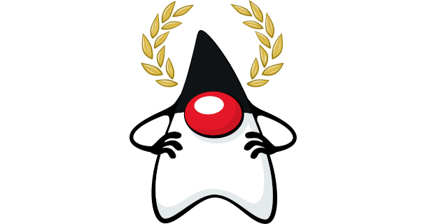

= Java Champions

The data collected in this repository is used to update link:javachampions.org[javachampions.org].

== What is a Java Champion?

One of the best descriptions was given in the 2009 JavaOne
Conference PDF:

"The Java Champions community was started by Sun at the 2005
JavaOne conference to recognize key influencers in the Java
community. Java Champions are influential Rock Star presenters
and Java technology educators, authors, and consultants; Java
platform event organizers; and others within the Java technology
ecosystem. For the third consecutive year, Java Champions have
contributed to the JavaOne conference process as technical
reviewers for paper submissions, have been recognized for their
achievements, and have shared their thoughts about the state of
the Java platform at their BOF sessions." From link:site/content/resources/javaone-2009.pdf[javaone-2009.pdf]

Note: This list is maintained by the Java Champions themselves.